# Guida alla configurazione — Qi-CRM

Questa guida spiega, passo passo, come passare dalla **modalità demo** (dati finti in locale)
a un'installazione **reale** con database Supabase, e come completare le configurazioni rimaste
in sospeso (canali di comunicazione, AI, app desktop).

> 🟢 **Non hai fretta?** Salta tutto: l'app funziona già da sola in modalità demo (vedi §2).
> Le sezioni Supabase (§4) e canali (§5) servono solo per usarla "in produzione".

---

## 1. Prerequisiti

- **Node.js** 18+ e **npm** (verifica con `node -v`).
- Un browser moderno (Chrome consigliato per l'AI locale, vedi §6).
- *(Opzionale, solo per l'app desktop)* **Rust** + toolchain Tauri (vedi §7).

---

## 2. Avvio rapido (modalità demo)

```bash
git clone <url-della-repo>
cd sovrano
npm install
npm run dev
```

Apri **http://localhost:5173**. Trovi un CRM già popolato con dati realistici salvati nel
`localStorage` del browser. Fai login con l'utente preimpostato, oppure prova ruoli diversi con
`marco@…`, `anna@…`, `luca@…`, `sara@…` (password qualsiasi).

In questa modalità il flag **`USING_MOCK`** (in `src/lib/repo.ts`) è `true` e compare il badge
**"Demo (dati mock)"**. Nessun dato esce dal tuo browser.

---

## 3. Variabili d'ambiente

Tutta la configurazione "segreta" passa da un file `.env.local` (ignorato da git, vedi
`.gitignore` → `*.local`). Parti dal template:

```bash
cp .env.example .env.local
```

Variabili disponibili:

| Variabile | Scopo | Obbligatoria |
|---|---|---|
| `VITE_SUPABASE_URL` | URL del progetto Supabase | per uscire dalla demo |
| `VITE_SUPABASE_ANON_KEY` | Chiave pubblica (anon) Supabase | per uscire dalla demo |
| `VITE_OPENAI_API_KEY` | Provider AI cloud opzionale (fallback a Gemini Nano locale) | no |

> Lasciando vuote `VITE_SUPABASE_URL`/`ANON_KEY`, resti automaticamente in modalità demo.

---

## 4. Collegare Supabase (passare in produzione)

### 4.1 Crea il progetto
1. Vai su **https://supabase.com** → *New project*.
2. Scegli nome, password del database e regione.
3. Da **Project Settings → API** copia:
   - **Project URL** → `VITE_SUPABASE_URL`
   - **anon public key** → `VITE_SUPABASE_ANON_KEY`

### 4.2 Configura `.env.local`
```bash
VITE_SUPABASE_URL=https://xxxxxxxx.supabase.co
VITE_SUPABASE_ANON_KEY=eyJhbGciOi...
```

### 4.3 Applica lo schema del database
1. Apri il progetto Supabase → **SQL Editor → New query**.
2. Incolla il contenuto di **`supabase/schema.sql`** (incluso nella repo) ed esegui (*Run*).
   Crea tabelle e policy: `profiles`, `companies`, `contacts`, `pipeline_stages`, `deals`,
   `activities`, `sentiment_logs`, `ai_insights`, `ai_memories`, `automations`.

### 4.4 Collega il data-layer (`repo.ts`)
L'app accede ai dati **solo** tramite `src/lib/repo.ts`, che oggi instrada tutto al backend
mock. Il client Supabase è già pronto in `src/lib/supabase.ts`. Per usarlo davvero devi fornire
un'implementazione `supabaseRepo` con gli **stessi metodi** dell'oggetto `repo`, e cambiare il
dispatch in fondo al file. Schema:

```ts
// src/lib/repo.ts (schema indicativo)
import { mockDb, resetMockDb } from './mock/mockDb';
import { supabase } from './supabase';

export const USING_MOCK = !import.meta.env.VITE_SUPABASE_URL /* ...controlli placeholder... */;

const mockRepo = { /* la mappa attuale verso mockDb.* */ };

const supabaseRepo = {
  listContacts: async () => (await supabase.from('contacts').select('*')).data ?? [],
  createContact: async (input) => (await supabase.from('contacts').insert(input).select().single()).data,
  // ...stessa firma per companies, deals, activities, pipelines, stages, tickets...
  resetDemo: resetMockDb, // in produzione puoi disabilitarlo
};

export const repo = USING_MOCK ? mockRepo : supabaseRepo;
export type Repo = typeof repo;
```

> 👉 **Importante:** nessun hook o componente va modificato. Cambi solo `repo.ts`. I nomi dei
> metodi da implementare sono quelli già elencati nell'oggetto `repo` esistente.

### 4.5 Autenticazione reale (opzionale ma consigliato)
In demo l'auth è finta (`src/store/authStore.ts` accetta qualsiasi credenziale). Per l'auth vera
usa **Supabase Auth**:
- `supabase.auth.signInWithPassword(...)` al posto del mock in `authStore`.
- Abilita i provider desiderati da **Supabase → Authentication**.
- La tabella `profiles` collega l'utente Supabase al ruolo CRM.

### 4.6 Verifica
Riavvia (`npm run dev`). Se le variabili sono corrette, **`USING_MOCK` diventa `false`**, il badge
"Demo (dati mock)" **sparisce** e i dati vengono letti/scritti su Supabase.

> Per tornare ai dati demo iniziali in qualsiasi momento: **Impostazioni → "Reset dati demo"**
> (svuota il `localStorage` dell'app e ricarica lo stato seed).

---

## 5. Configurare i canali di comunicazione (Integrazioni)

Le credenziali dei canali si inseriscono **dall'app**, da **Integrazioni** (visibile al
superadmin) e vengono salvate in `orgSettingsStore`. Ogni canale ha un badge di stato
(*non configurato → configurato → connesso*) e una mini-guida integrata.

| Canale | Cosa ti serve | Dove ottenerlo |
|---|---|---|
| **Email transazionale** | API Key, mittente, dominio | Resend / SendGrid |
| **Email Marketing** | provider SMTP, host, porta, API key | SendGrid / SES / Mailgun / SMTP |
| **WhatsApp** | Phone Number ID, Business Account ID, Access Token | Meta → WhatsApp Cloud API |
| **Telegram** | Bot Token, username del bot | @BotFather su Telegram |
| **Google Calendar/Meet** | Client ID, Client Secret, redirect URI | Google Cloud Console (OAuth) |
| **SMS** | Account SID, Auth Token, numero mittente (E.164) | Twilio Console |
| **Push** | chiavi VAPID *oppure* FCM Server Key | self-generate / Firebase |
| **Social** | Meta: App ID/Secret, Page ID/Token, IG ID · LinkedIn: Client ID/Secret, Org URN, Token | Meta for Developers / LinkedIn Marketing Platform |

WhatsApp, Telegram, Email e Google dispongono già di **test di connessione reali** nell'interfaccia.

> ⚠️ **Importante:** i campi di configurazione sono completi, ma l'**invio reale di massa**
> (broadcast, sequenze) richiede un piccolo backend che legga queste credenziali e chiami i
> provider — vedi §8. In modalità demo gli invii sono **simulati** (con metriche realistiche).

---

## 6. AI locale (Gemini Nano)

L'AI Hub usa **Gemini Nano** tramite `window.ai`, che gira **localmente nel browser** (privacy
totale, zero costi cloud).

- Richiede **Google Chrome** recente con l'AI integrata abilitata
  (`chrome://flags` → *Prompt API for Gemini Nano*, dove disponibile).
- Se `window.ai` non è disponibile, l'AI Hub lo segnala. In alternativa puoi predisporre un
  provider cloud impostando `VITE_OPENAI_API_KEY` (richiede l'apposita integrazione lato codice).

---

## 7. App desktop (Tauri) — opzionale

Per generare l'eseguibile desktop (più leggero di Electron, usa la WebView del sistema):

1. Installa **Rust**: https://www.rust-lang.org/tools/install
2. Comandi:
   ```bash
   npm run tauri:dev     # sviluppo desktop
   npm run tauri:build   # build dell'eseguibile (.app/.exe/.deb…)
   ```

---

## 8. Configurazioni rimaste in sospeso (richiedono backend)

Queste funzioni hanno **UI e configurazione pronte** ma, per agire "davvero", necessitano di un
backend (consigliate **Supabase Edge Functions** + **pg_cron** per lo scheduling):

1. **Invio reale dei canali** — una Edge Function legge le credenziali da `orgSettings` e chiama:
   Resend/SendGrid (email), Meta Graph (WhatsApp), Telegram Bot API, Twilio (SMS), FCM/Web Push,
   Meta/LinkedIn (social).
2. **Sequenze & Broadcast schedulati** — pg_cron per eseguire gli step nel tempo.
3. **Ricezione email→documento e web-to-lead in produzione** — un endpoint pubblico (Edge
   Function) che riceve i webhook in ingresso.
4. **Social Studio "live"** — collegare `socialStore` alle credenziali reali di `orgSettings.social`.

Finché non li implementi, l'app resta pienamente utilizzabile: queste azioni vengono **simulate**
in modo realistico, così la demo è completa anche senza infrastruttura.

---

## 9. Altre configurazioni da non dimenticare

Oltre a Supabase e ai canali, ci sono alcuni **segnaposto demo** e impostazioni da personalizzare
prima di andare in produzione.

### 9.1 Branding e dati azienda (Impostazioni)
I default sono di esempio (`XYZ S.r.l.`, `xyz.it`). Aggiorna in **Impostazioni**:
- Nome azienda, sito web, **logo**, colore accento, sottotitolo della pagina di login.
- Indirizzi mittente (`from_address` / `from_name`) per email transazionali e marketing.
Compaiono su login, **contratti**, **fatture** ed email.

### 9.2 Domini, redirect URI e webhook (sostituire i placeholder `qi-crm.app`)
Il codice usa domini di esempio. Aggiornali col tuo dominio reale:
- **Google OAuth redirect URI** — `redirect_uri` in `orgSettings` (default
  `https://app.qi-crm.app/oauth/google/callback`) deve coincidere **esattamente** con quello
  registrato nella Google Cloud Console.
- **Webhook in entrata** mostrati in Integrazioni (`api.qi-crm.app/webhooks/whatsapp`,
  `/webhooks/telegram`, `/inbound/...`) → puntali al tuo backend reale (Edge Function) e
  registrali nei pannelli Meta / Telegram.
- **WhatsApp Verify Token** — default `sovrano_verify`: scegline uno tuo, **identico** tra app e Meta.

### 9.3 Sicurezza (Impostazioni → Sicurezza)
2FA, timeout di sessione, lunghezza minima password, IP allowlist. Con Supabase Auth reale,
configura provider e policy anche lato Supabase.

### 9.4 Orari di lavoro & SLA
Imposta timezone, orari, giorni lavorativi e SLA di prima risposta: sono usati dal **Booking
pubblico** (generazione degli slot) e dagli **SLA dei ticket**.

### 9.5 Team, ruoli e pipeline
- Invita i membri reali (sezione **Team**) e assegna ruoli/permessi.
- Personalizza gli **stage della Pipeline** (nomi e probabilità): incidono su Forecast e Lead Score.

### 9.6 App desktop — identificativo & icone
In `src-tauri/tauri.conf.json` aggiorna l'`identifier` (attualmente `com.sovrano.crm`) con un
reverse-domain tuo, e sostituisci le icone in `src-tauri/icons/` prima di una release.

### 9.7 Deploy web (routing SPA)
L'app usa `BrowserRouter`: l'hosting deve fare **fallback a `index.html`** per **tutte** le route,
incluse le pubbliche `/book`, `/form-demo`, `/landing`, `/document` — altrimenti i deep-link danno 404.
- **Vercel**: rewrite `/(.*) → /index.html`.
- **Netlify**: file `_redirects` con `/*  /index.html  200`.
- `npm run build` genera la cartella `dist/` da pubblicare.

### 9.8 Deliverability email & provider
- Verifica il dominio mittente (record **SPF/DKIM**) su Resend/SendGrid per non finire in spam.
- WhatsApp: registra il numero e fai **approvare i template** su Meta prima dell'invio in produzione.

---

## 10. Troubleshooting

| Sintomo | Causa probabile | Soluzione |
|---|---|---|
| Badge "Demo" sempre presente | env non lette | controlla `.env.local`, riavvia `npm run dev` |
| Errori Supabase in console | schema non applicato | esegui `supabase/schema.sql` nel SQL Editor |
| Dati strani/duplicati dopo update | seed cambiato ma localStorage vecchio | **Impostazioni → Reset dati demo** |
| AI Hub non risponde | `window.ai` non disponibile | usa Chrome con AI abilitata, o un provider cloud |
| `npm run build` fallisce | versione Node non compatibile | usa Node 18+ |

---

## 11. Manuale d'uso — pagina per pagina

> 📸 **Screenshot:** le immagini sono in `docs/screenshots/`. Se un'immagine non compare,
> non è ancora stata catturata: vedi [`docs/screenshots/README.md`](./docs/screenshots/README.md)
> per la procedura e i nomi file. Il manuale resta valido anche senza immagini.

### 11.0 Concetti di base (validi ovunque)

- **Login** — Accedi con le credenziali (in demo qualsiasi password). Il **superadmin** vede tutto;
  ruoli diversi (`marco@`, `anna@`, `luca@`, `sara@`) vedono solo le sezioni permesse.
  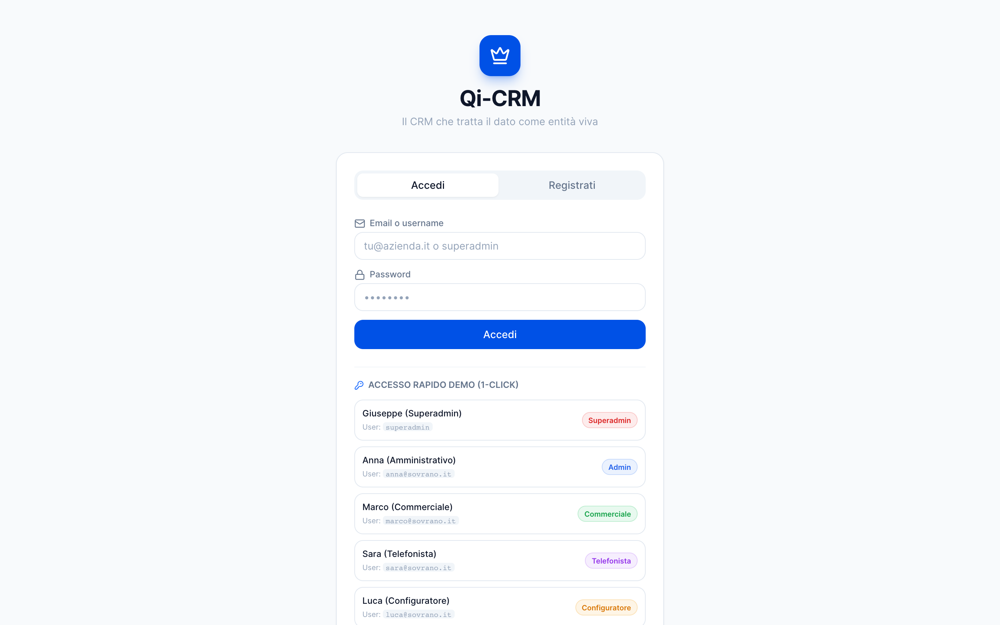
- **Barra laterale (Sidebar)** — Navigazione tra le pagine, raggruppata per area. Il pulsante in
  basso comprime/espande la barra.
- **Header (in alto)** — Pulsante **"Crea"** (Quick-Add) per creare al volo contatto/deal/ticket/
  promemoria; **ricerca globale** ⌘K (Command Palette); **campanella** notifiche; **tema chiaro/scuro**.
- **Badge "Demo (dati mock)"** — Indica che stai usando dati locali finti (vedi §2/§4).
- **Toast** — I messaggi di conferma compaiono in basso a destra.

---

### 11.1 Operatività quotidiana

#### Dashboard (`/`)
- **A cosa serve:** panoramica iniziale con saluto personalizzato ("Buongiorno, …") e dashboard di
  report personalizzabile.
- **Mostra:** widget KPI e grafici (ricavi, deal, attività…).
- **Pulsanti:** *Aggiungi Report*, *Nuova Dashboard*, *Filtri del report*, libreria report.
- **Come si usa:** aggiungi i report che vuoi monitorare; salvali nelle tue dashboard.
  

#### Il mio giorno (`/today`)
- **A cosa serve:** cockpit personale dell'operatore.
- **Mostra:** KPI sintetici, promemoria di oggi, ticket da gestire, scadenze imminenti, documenti recenti.
- **Come si usa:** punto di partenza della giornata; clicca un elemento per saltare alla pagina relativa.
  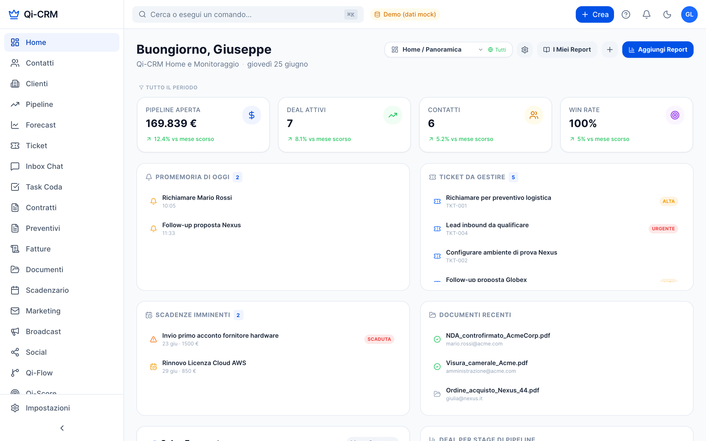

#### Coda Attività / Tasks (`/tasks`)
- **A cosa serve:** organizzare i task in **code di lavoro** ed eseguirli in sequenza.
- **Mostra:** elenco code (sinistra) e task della coda selezionata (tipo, priorità, scadenza, entità collegata).
- **Pulsanti:** *Crea Task*, *Crea Nuova Coda*, **Avvia Coda di Lavoro**.
- **Come si usa:** premi **Avvia Coda di Lavoro** → l'app apre il record del primo task e mostra in alto
  la **barra di esecuzione** (*Completa e avanti* / *Salta* / *Precedente* / *Riprogramma*): completando
  un task vieni portato automaticamente al successivo, fino a fine coda.
  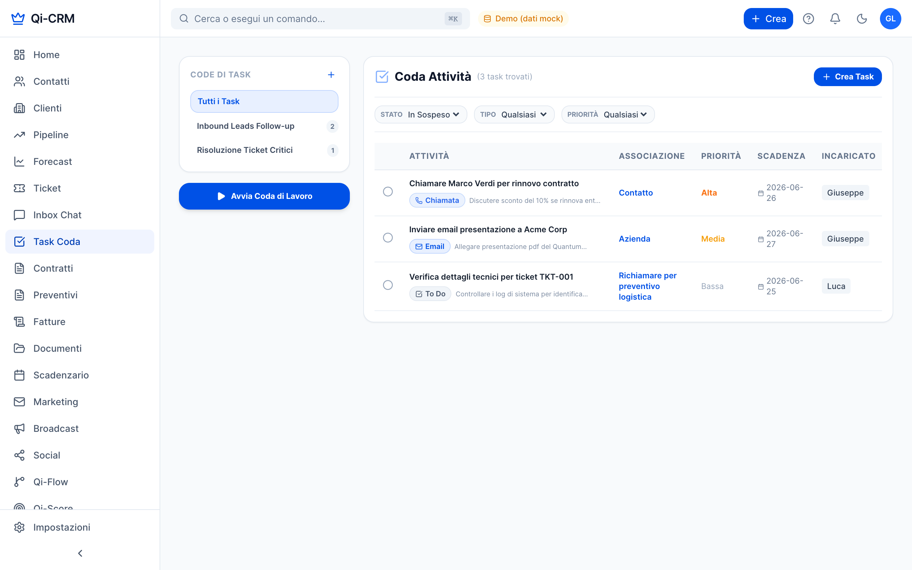
  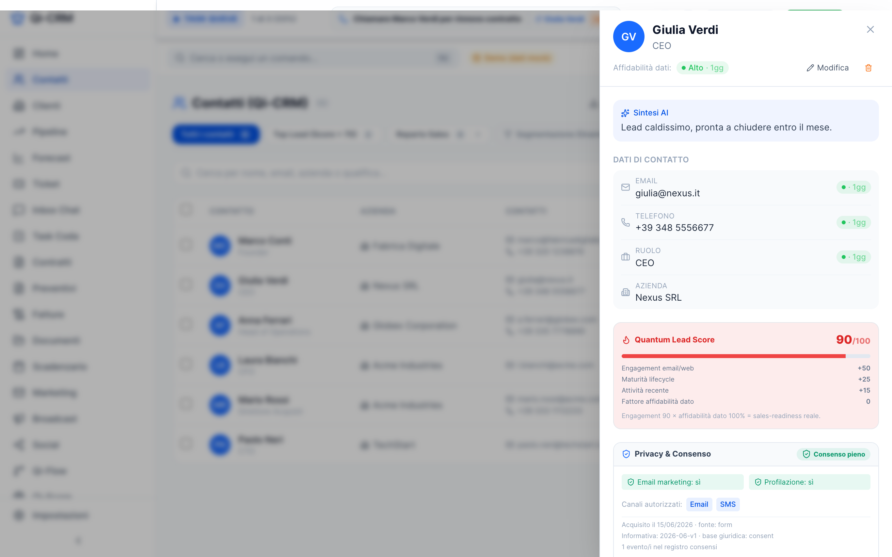

#### Promemoria (`/reminders`)
- **A cosa serve:** promemoria personali e di team, multicanale.
- **Mostra:** promemoria in sospeso e (tab) inviati/completati, con canali (visual/email/telegram/whatsapp).
- **Pulsanti:** *Nuovo Promemoria*.
- **Come si usa:** crea un promemoria con data/ora e canali; alla scadenza ricevi il toast (e, con backend, l'invio reale).
  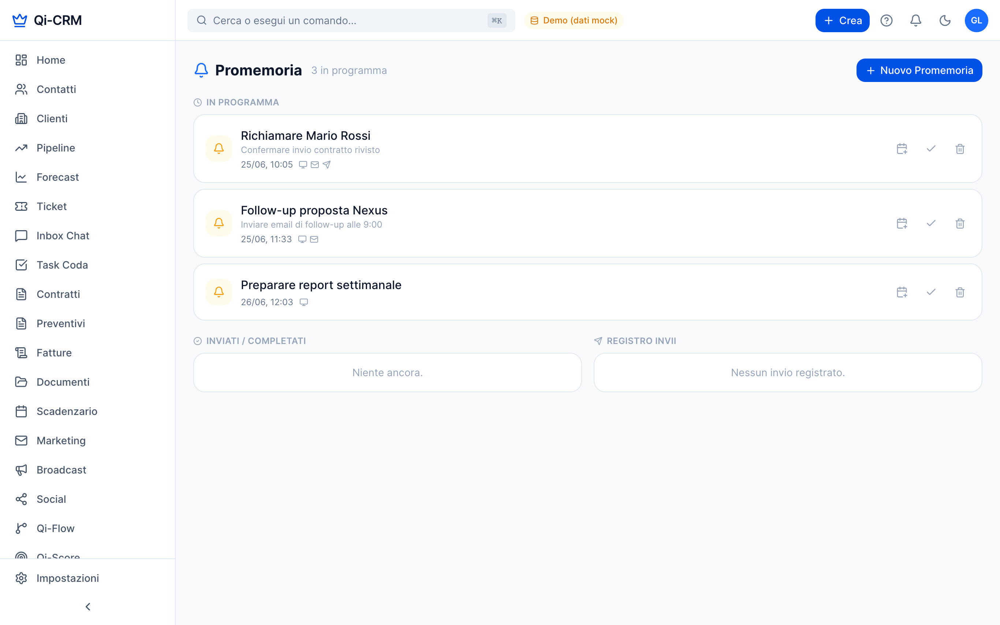

---

### 11.2 Vendite

#### Contatti (`/contacts`)
- **A cosa serve:** anagrafica delle persone.
- **Mostra:** tabella con Affidabilità (**Trust Score**) e **Lead Score** (Quantum), azienda, recapiti.
- **Pulsanti:** *Nuovo*, *Cattura AI* (estrazione zero-entry da testo), *Importa CSV*, *Esporta*,
  *Filtri/Segmenti* (viste salvate), azioni massive (esporta/elimina/iscrivi a sequenza).
- **Come si usa:** clicca un contatto per aprire la **scheda** con campi tracciati (provenienza+affidabilità),
  card **Quantum Lead Score** (engagement × affidabilità) ed engagement e timeline attività.
  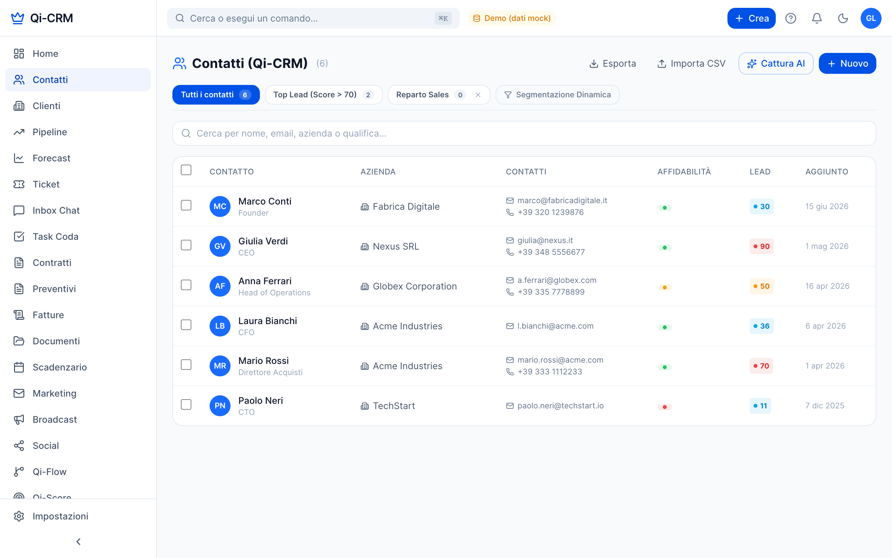
  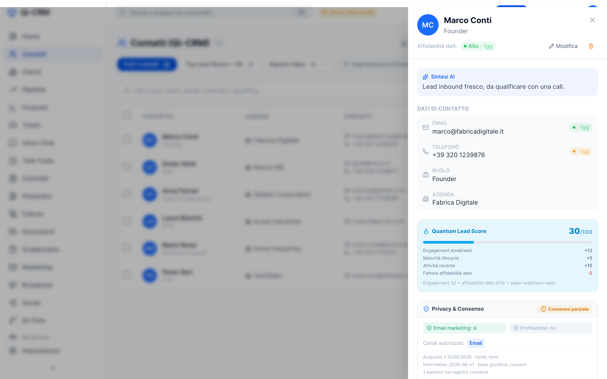

#### Clienti / Aziende (`/companies`)
- **A cosa serve:** anagrafica delle aziende clienti.
- **Mostra:** elenco aziende; scheda con **org-chart** (società controllanti/controllate), contatti e deal collegati.
- **Come si usa:** apri una scheda per vedere la struttura aziendale e le opportunità correlate.
  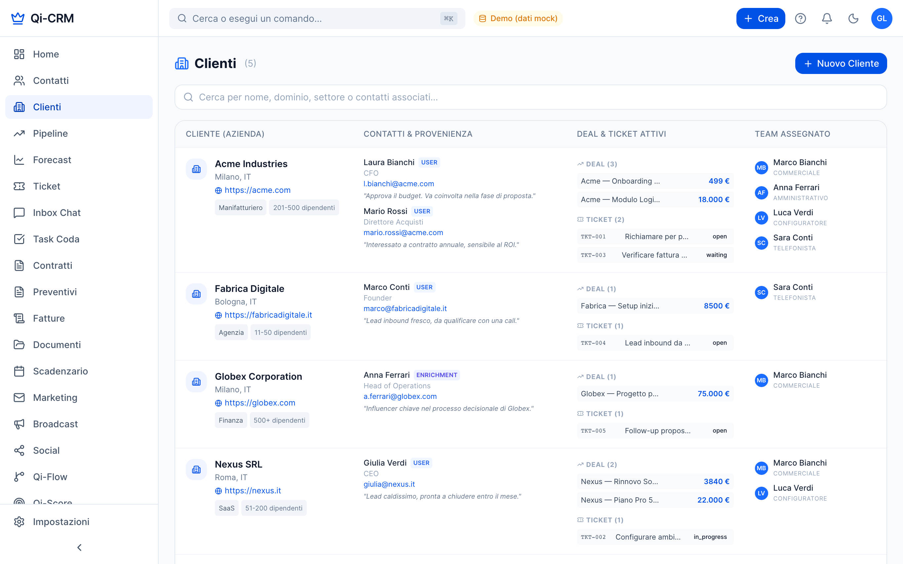

#### Pipeline (`/pipeline`)
- **A cosa serve:** gestione delle opportunità (deal) in stile Kanban.
- **Mostra:** colonne per stage; card colorate per rischio; filtro "I miei".
- **Pulsanti:** *Crea deal*, *Impostazioni pipeline* (modifica stage/probabilità), toggle "I miei".
- **Come si usa:** trascina i deal tra gli stage; apri un deal per la **scheda** con **Guida alla vendita
  (Sales Path)** — stepper, checklist e *Next Best Action* — più insight AI, prodotti e documenti collegati.
  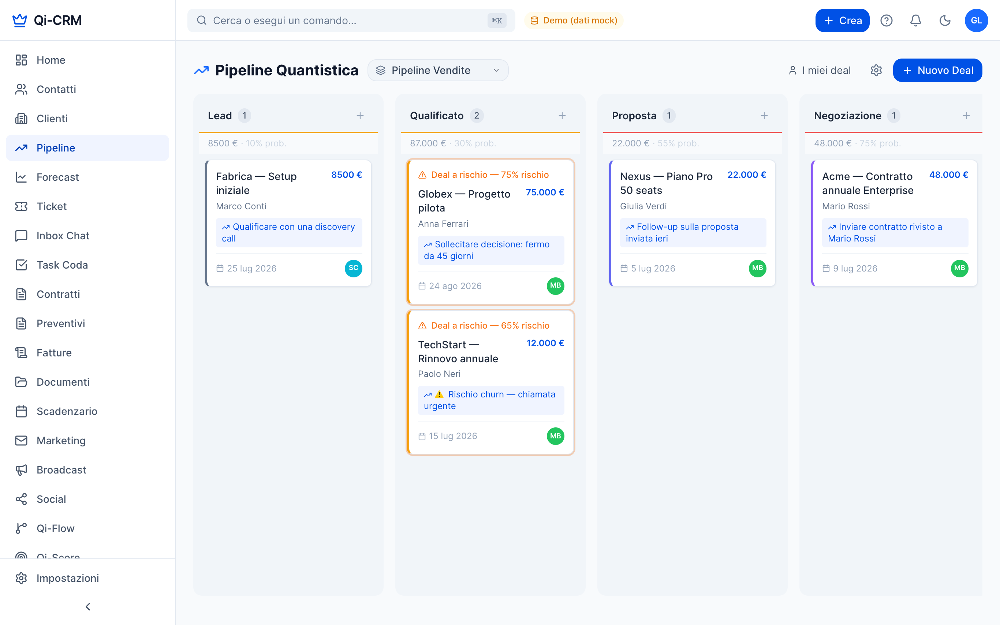
  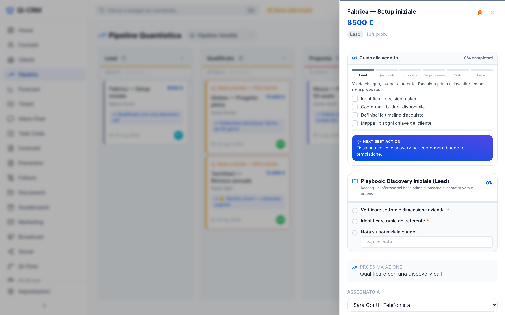

#### Forecast & Quota (`/forecast`)
- **A cosa serve:** previsione di vendita pesata e raggiungimento quota.
- **Mostra:** selettore periodo; KPI team (Quota, Chiuso, Forecast pesato, Attainment, Coverage);
  composizione per **categoria** (Closed/Commit/Best Case/Pipeline); **Qi-Forecast AI confidence**;
  tabella per venditore con quota modificabile.
- **Come si usa:** scegli il mese, imposta le quote (admin) e leggi attainment e forecast pesato.
  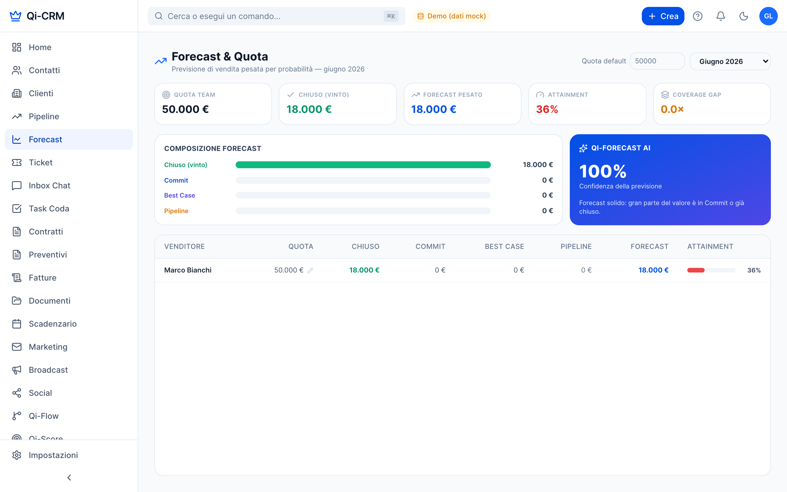

#### Preventivi (`/quotes`)
- **A cosa serve:** creare preventivi con righe e IVA.
- **Pulsanti:** *Nuovo Preventivo*, aggiunta righe, *Salva Bozza*, conversione in fattura.
- **Come si usa:** componi le righe, applica IVA, invia/condividi; uno stato traccia l'avanzamento.
  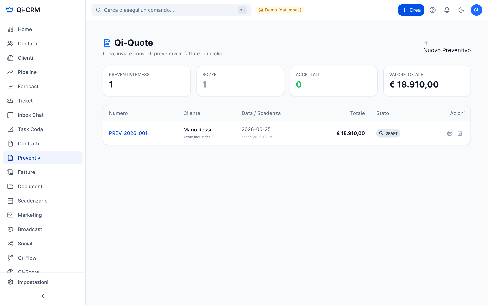

#### Contratti & Firma Digitale (`/contracts`)
- **A cosa serve:** generare contratti e farli **firmare con crittografia reale** (Web Crypto API).
- **Pulsanti:** *Nuovo Contratto*, *Crea Bozza*, invio per firma.
- **Come si usa:** crea la bozza, invia per la firma (flusso con OTP); la firma genera un hash SHA-256 +
  coppia di chiavi RSA verificabile.
  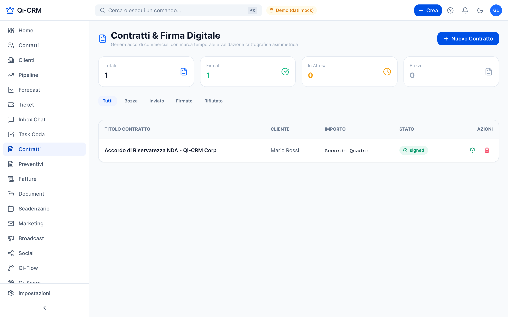

---

### 11.3 Comunicazione & Marketing

#### Marketing (`/marketing`)
- **A cosa serve:** strumenti inbound. Tab: **Moduli**, **Landing Pages**, **Email Marketing**,
  **Templates & Snippets**, **Chatflow Bot**, **Log Sottomissioni**.
- **Come si usa:** crea un **modulo** (con anteprima e codice da incorporare); abilitando *"Crea Deal"*
  ogni compilazione genera Contatto **+ Deal** in pipeline. Le **landing** pubblicano i moduli; le
  **campagne email** simulano l'invio; il **bot** è provabile con il simulatore.
  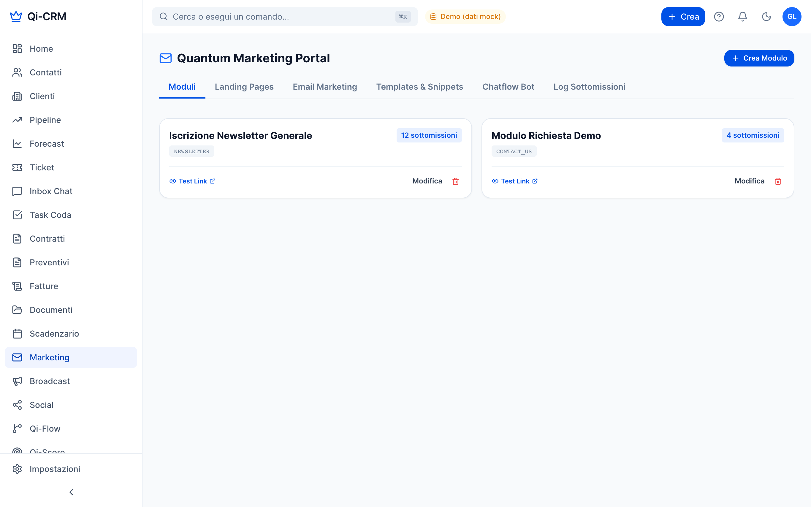

#### Broadcast Omnicanale (`/broadcast`)
- **A cosa serve:** invii di massa su **Email/SMS/WhatsApp/Telegram/Push** con **A/B test**.
- **Mostra:** elenco broadcast con stato e metriche (consegnati, aperture, CTR, vincitore A/B).
- **Pulsanti:** *Crea Broadcast*, *Invia ora*.
- **Come si usa:** scegli canale e **segmento** (tutti/tag/lifecycle/stato), abilita A/B e Guardian AI,
  poi invia: ottieni le metriche per variante e il vincitore per CTR (in demo l'invio è simulato).
  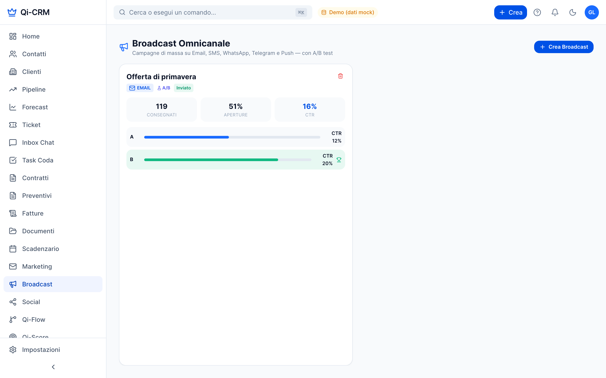

#### Social Studio (`/social`)
- **A cosa serve:** pianificare post e gestire i social. Tab: **Connessioni**, **Calendario Post**, **Inbox Social**.
- **Come si usa:** collega FB/IG/LinkedIn (config in Integrazioni), pianifica post multi-piattaforma,
  rispondi a commenti e DM dall'inbox unificata.
  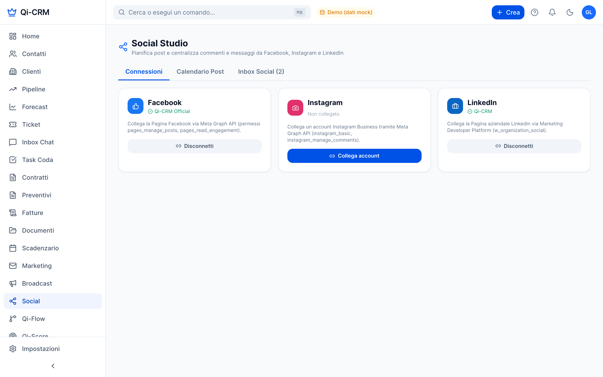

#### Qi-Flow / Sequenze (`/sequences`)
- **A cosa serve:** sequenze di follow-up multi-step.
- **Pulsanti:** *Crea Sequenza*, *Aggiungi Step*.
- **Come si usa:** definisci gli step; iscrivi i contatti (anche in massa da Contatti).
  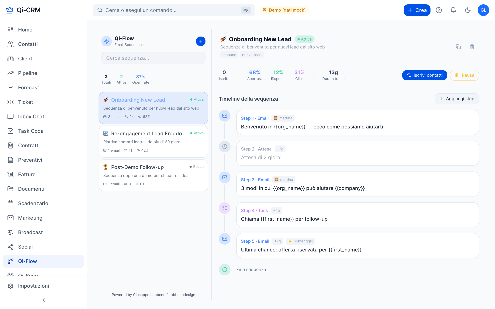

#### Qi-Score / Lead Scoring (`/lead-scoring`)
- **A cosa serve:** regole di punteggio dei lead (engagement / fit / decadimento).
- **Pulsanti:** *Nuova Regola*.
- **Come si usa:** definisci le regole; il punteggio aiuta a prioritizzare i contatti "caldi".
  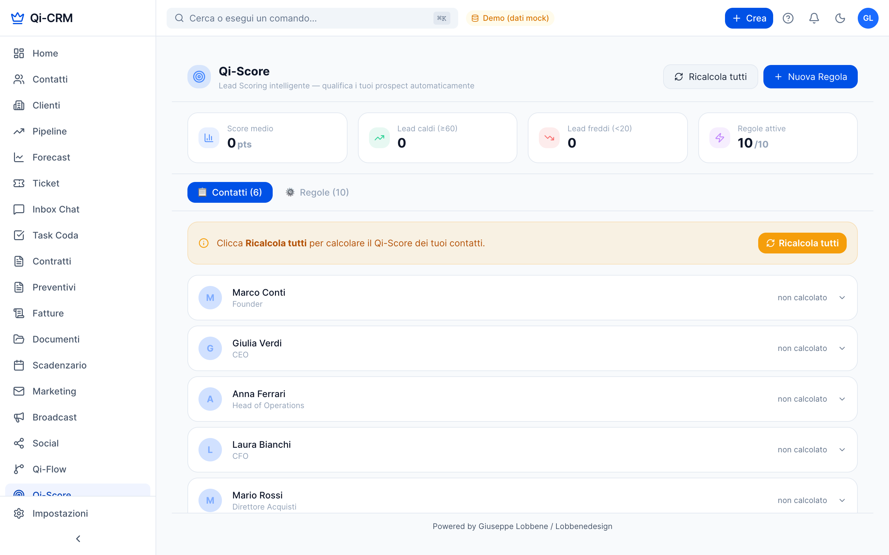

#### Automazioni (`/automations`)
- **A cosa serve:** costruire **Journey** automatici con un editor a nodi.
- **Pulsanti:** *Nuovo Journey*, *Salva Flow*.
- **Come si usa:** trascina i nodi (trigger / azione / condizione / attesa), collegali e salva; attiva il journey.
  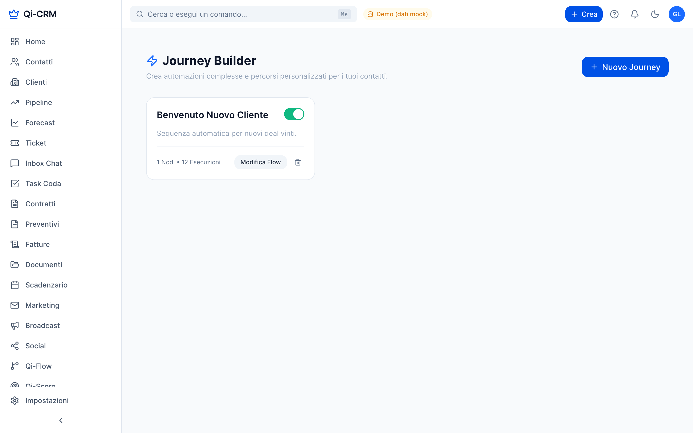

---

### 11.4 Assistenza & Documenti

#### Ticket (`/tickets`)
- **A cosa serve:** gestione richieste/assistenza con smistamento.
- **Pulsanti:** *Nuovo Ticket*, viste salvate, filtro "i miei".
- **Come si usa:** crea il ticket (categoria, priorità); viene assegnato secondo le regole di smistamento;
  apri la scheda per lavorarlo.
  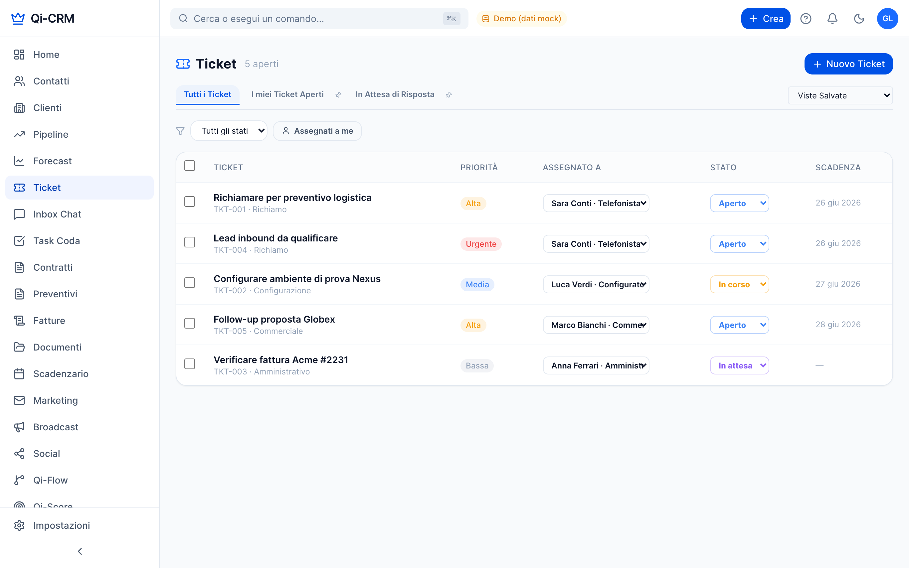

#### Inbox Chat (`/inbox`)
- **A cosa serve:** posta conversazionale unificata (email/chat/messenger).
- **Come si usa:** seleziona una conversazione a sinistra e rispondi nel thread.
  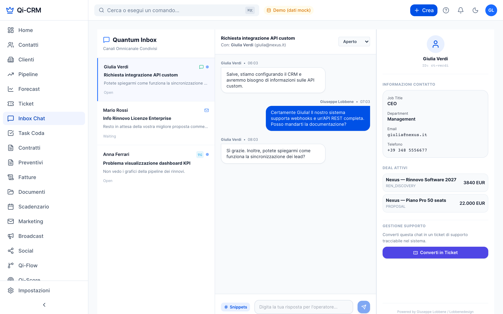

#### Documenti (`/documents`)
- **A cosa serve:** vista unificata di documenti ricevuti + contratti + fatture, per deal.
- **Pulsanti:** filtro per deal, simulatore di ricezione, link condivisibile tracciato, eliminazione massiva.
- **Come si usa:** ogni deal ha un indirizzo email-to-CRM; i documenti ricevuti si collegano al deal.
  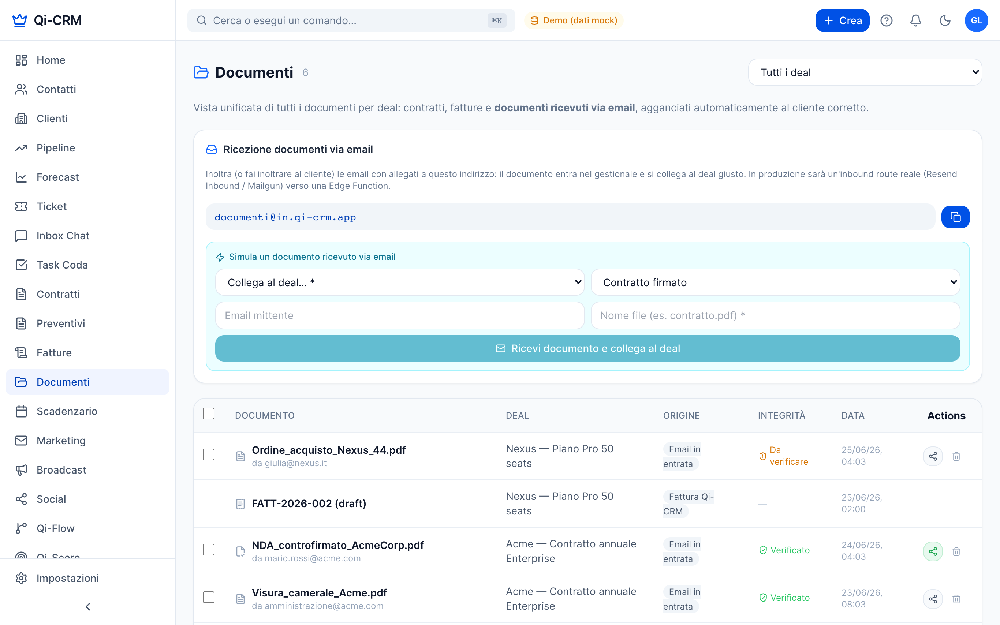

#### Fatture (`/invoices`)
- **A cosa serve:** creare e inviare fatture.
- **Come si usa:** componi righe e IVA, invia, **stampa PDF A4**; lo stato traccia pagato/non pagato.
  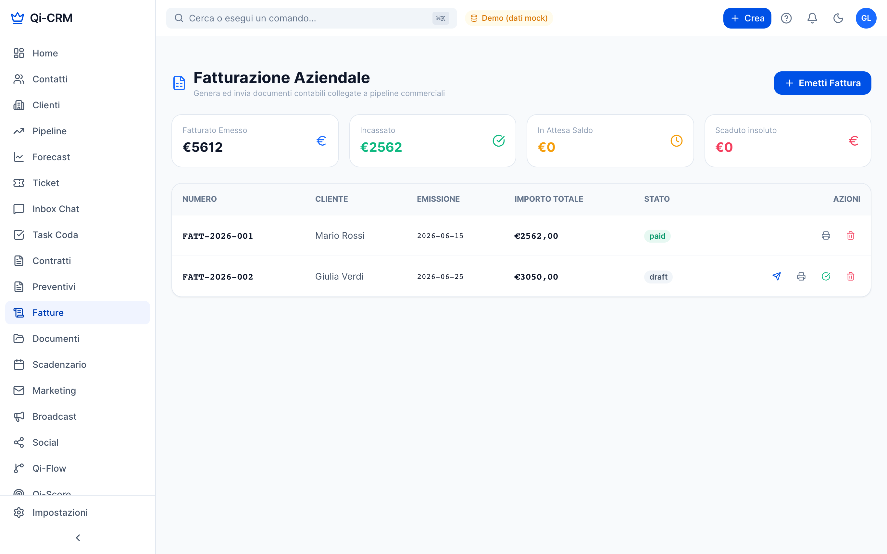

#### Scadenzario (`/deadlines`)
- **A cosa serve:** scadenze aziendali (fiscali, contrattuali, rinnovi).
- **Pulsanti:** *Nuova Scadenza*.
- **Come si usa:** crea le scadenze con data e tipo; ricevi notifiche all'avvicinarsi.
  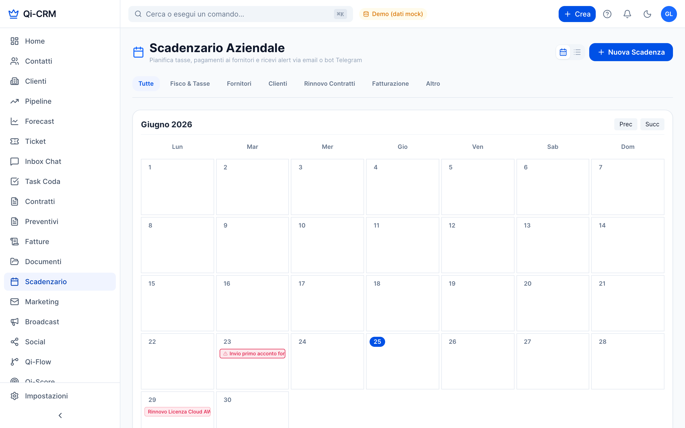

---

### 11.5 Intelligence

#### Analytics (`/analytics`)
- **A cosa serve:** report e grafici (performance vendite, KPI).
- **Come si usa:** consulta i grafici; utile per management.
  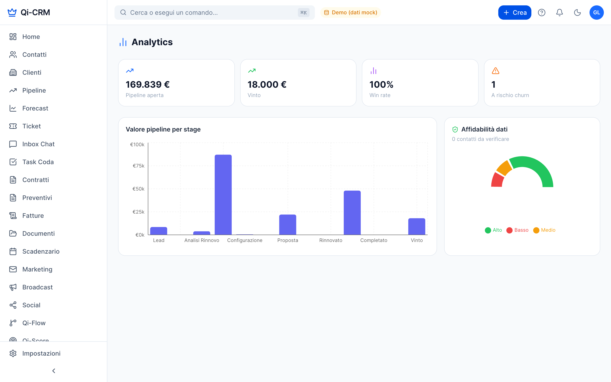

#### AI Strategy Assistant (`/ai`)
- **A cosa serve:** assistente AI **locale** (Gemini Nano) che ragiona sui tuoi dati CRM (RAG locale).
- **Come si usa:** poni domande in linguaggio naturale (richiede Chrome con AI abilitata, vedi §6).
  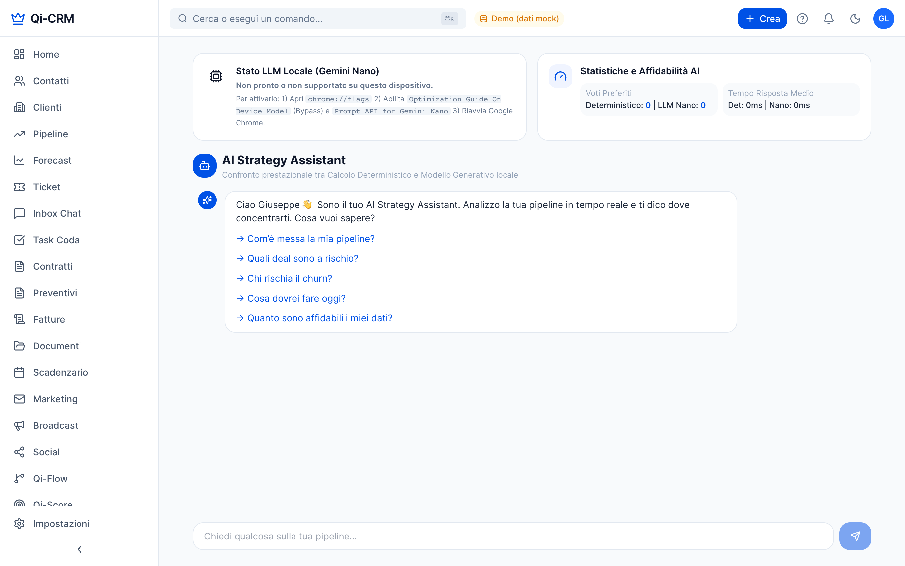

---

### 11.6 Amministrazione (superadmin)

#### Team & Organizzazione (`/team`)
- **A cosa serve:** membri, ruoli e gruppi.
- **Pulsanti:** invito membri, *Crea Ruolo*, *Crea Nuovo Team*, **copia link prenotazione** (per membro).
- **Come si usa:** invita gli utenti, assegna ruoli/permessi, crea gruppi di competenza.
  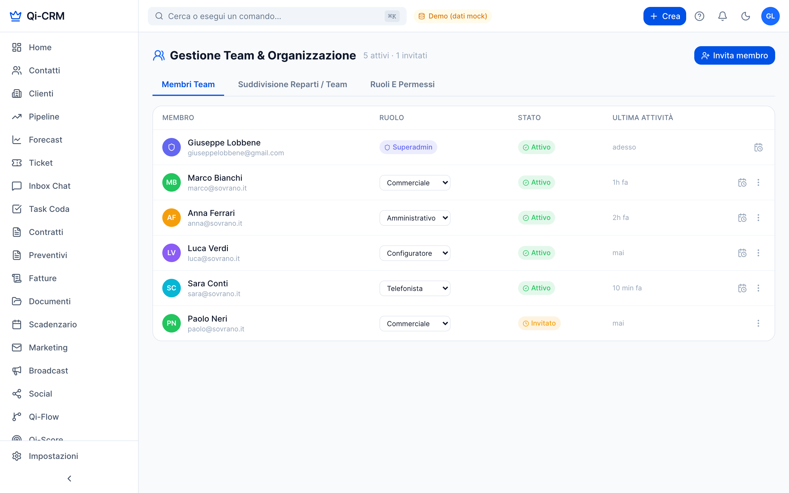

#### Integrazioni & Canali (`/integrations`)
- **A cosa serve:** configurare i canali reali (vedi §5): Email, WhatsApp, Telegram, Google, SMS, Push,
  Social, Web-to-Lead.
- **Come si usa:** compila le credenziali in ogni scheda (mini-guida inclusa) e usa i **test di connessione**
  dove disponibili. Il badge di stato passa da *non configurato* a *connesso*.
  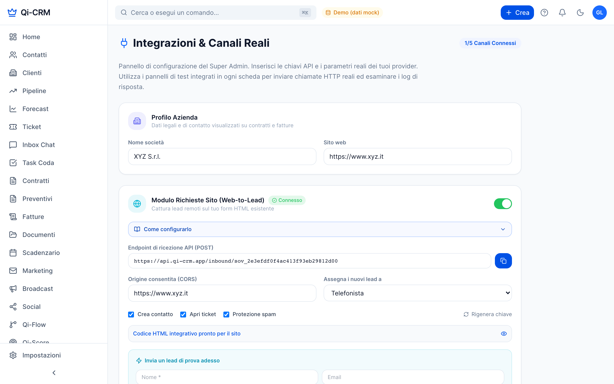

#### Audit Log (`/audit`)
- **A cosa serve:** registro cronologico delle azioni sensibili (chi/cosa/quando).
- **Come si usa:** consulta per tracciabilità e sicurezza.
  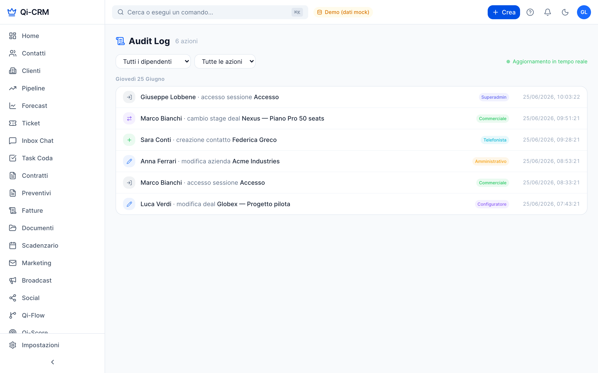

#### Impostazioni (`/settings`)
- **A cosa serve:** dati azienda, branding, orari di lavoro/SLA, sicurezza, gestione dati.
- **Pulsanti:** **"Reset dati demo"** (ripristina lo stato iniziale).
- **Come si usa:** personalizza l'organizzazione (vedi §9 per i segnaposto da sostituire).
  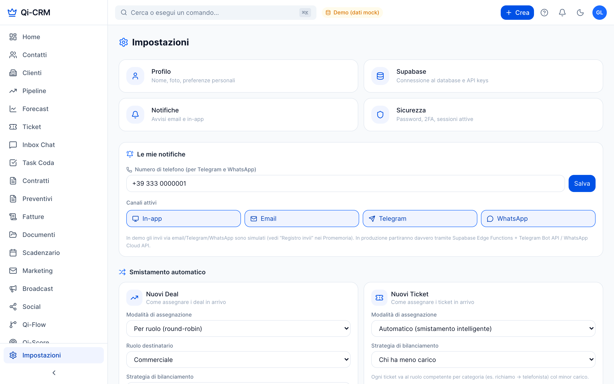

---

### 11.7 Pagine pubbliche (senza login)

- **Prenotazione** (`/book/:id` e `/book/team/:teamId`) — agenda pubblica self-service: il cliente
  sceglie tipo incontro e slot; l'app crea Contatto + appuntamento + promemoria e offre "Aggiungi a Google Calendar".
  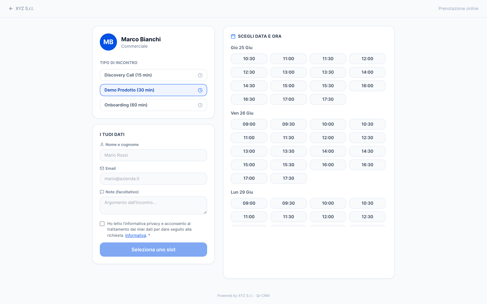
- **Form pubblico** (`/form-demo/:id`) e **Landing** (`/landing/:slug`) — raccolgono lead; alla
  compilazione creano Contatto (e Deal se il modulo lo prevede).
  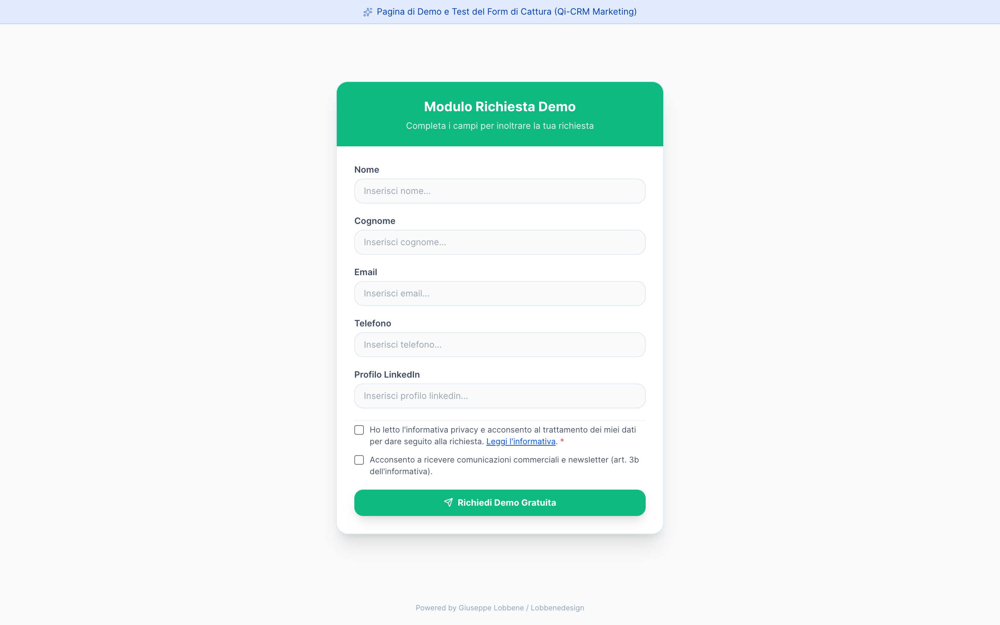
- **Document Gate** (`/document/:id`) — visione protetta di un documento condiviso (richiede email per tracciare le aperture).

---

### 11.8 Privacy & Consenso (GDPR) — come funziona il flusso

**Idea di fondo.** Ogni contatto ha un "contenitore di consensi" (`contact.consent`). Le funzioni
di marketing non guardano solo l'indirizzo email: chiedono prima al consenso *"posso?"*. Se il
cliente non ha autorizzato quella finalità/canale, la funzione **non parte**. È il collegamento
**autorizzazione → azione**.

#### 1) Il dato che registriamo sul contatto
- **marketing** (sì/no) e su **quali canali** (email, SMS, WhatsApp, telefono)
- **profilazione** (sì/no) — lead/trust scoring e segmentazione
- **terze parti** (sì/no)
- **metadati legali**: data di rilascio/revoca, **fonte**, **versione informativa**, base giuridica
- **registro eventi** (storico immutabile di ogni variazione → accountability art. 7)

#### 2) Come arriva il consenso (3 strade, stesso risultato)
- **A — Form pubblici** (Form, Landing, Booking): il cliente vede l'informativa + checkbox; senza
  la checkbox obbligatoria **l'invio è bloccato**. Alla compilazione il consenso è salvato sul contatto.
- **B — Modulo digitale firmabile**: dalla scheda contatto → *Gestisci consensi → Genera link* →
  ottieni un URL `/consent/:token` da inviare. Il cliente spunta le singole sezioni e **firma**:
  la firma scrive i consensi sul contatto.
  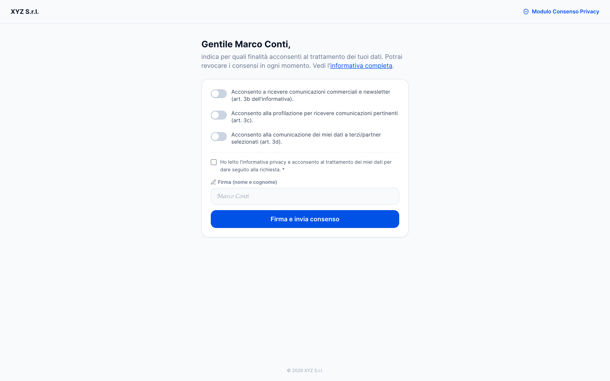
- **C — Modulo cartaceo + controfirma**: *Stampa modulo* (PDF con caselle e righe firma
  cliente/azienda); quando torna firmato, l'operatore imposta le concessioni e clicca
  *Registra e controfirma* → scrive il consenso + registra la controfirma.
  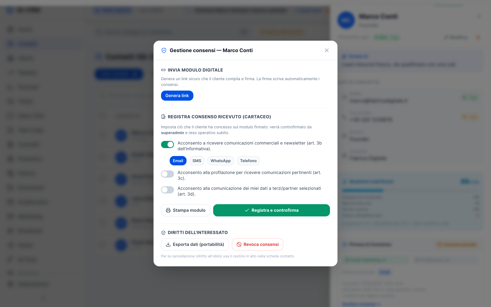

#### 3) Il "cervello": i gate
Due funzioni decidono cosa è permesso leggendo il consenso:
- `canSendMarketing(contatto, canale)` → vero solo se marketing = sì **e** non revocato **e** quel
  canale è autorizzato;
- `canProfile(contatto)` → vero solo se profilazione = sì e non revocato.

#### 4) L'enforcement (dove "morde")
Nel **Broadcast** i contatti senza consenso per il canale vengono **esclusi automaticamente**
(con conteggio *"X esclusi per mancato consenso"*); si invia solo ai consenzienti e le email
includono il footer obbligatorio *"Gestisci preferenze / Disiscriviti"*.
> Esempio demo: il contatto *Paolo Neri* non ha consenso → in un broadcast email viene escluso.

#### 5) Cosa vede l'operatore (scheda contatto)
La card *Privacy & Consenso* mostra stato (pieno/parziale/revocato/nessuno), **cosa è permesso**
("Email marketing: sì", "Profilazione: no"), canali, fonte, versione informativa e n° eventi nel registro.

#### 6) Diritti del cliente (GDPR)
Da *Gestisci consensi*: **Esporta dati** (portabilità, art. 20), **Revoca consensi** (art. 7.3,
registra la revoca nel log); **Cancellazione** (oblio) dal cestino della scheda. Informativa
pubblica su **`/privacy`** (art. 13).
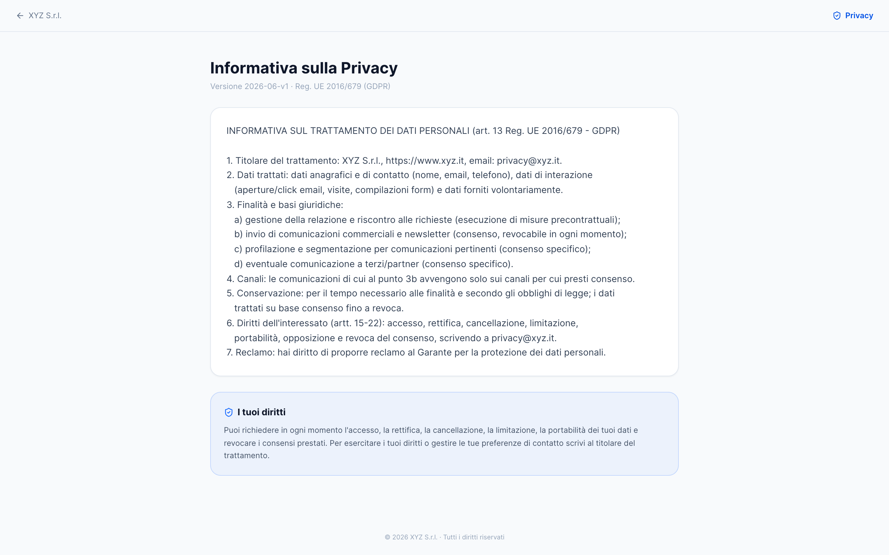

#### In una riga
**Raccolta** (form / firma digitale / cartaceo controfirmato) → **scrive `contact.consent`** →
**i gate** → **il marketing fa solo ciò che è concesso** → **diritti** (export / revoca / oblio),
tutto tracciato nel registro consensi.

---

Per l'architettura interna del progetto (perché React/Zustand/Tauri/WebCrypto, pattern repository,
Trust Score, ecc.) vedi **[technical_interview.md](./technical_interview.md)**.
Bug noti e migliorie pianificate: **[TODO.md](./TODO.md)**.
